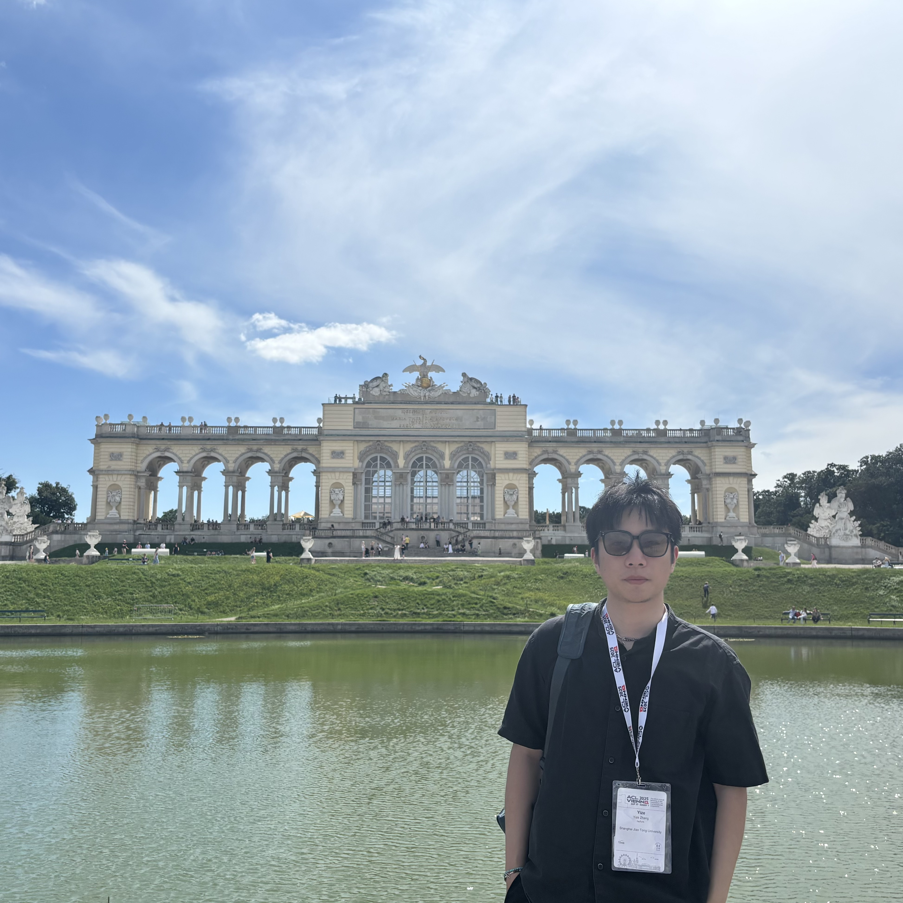

I am a PhD student at [Shanghai Jiao Tong University](https://en.sjtu.edu.cn/) and [Shanghai Innovation Institute](https://www.sii.edu.cn/), supervised by [Dr. Chaochao Lu](https://causallu.com/).

I study methods for training and deploying agents in non-stationary environments.

# Paper

- **CauSight: Learning to Supersense for Visual Causal Discovery**  
  Yize Zhang\*, Meiqi Chen\*, Sirui Chen\*, Bo Peng\*, Yanxi Zhang, Tianyu Li, Chaochao Lu  
  Under review  
    [paper](https://arxiv.org/abs/2512.01827) |
    [repo](https://github.com/OpenCausaLab/CauSight) |
    [model](https://huggingface.co/OpenCausaLab/CauSight) |
    [data](https://huggingface.co/datasets/OpenCausaLab/VCG-32K)

- **ARise: Towards Knowledge-Augmented Reasoning via Risk-Adaptive Search**  
  Yize Zhang\*, Tianshu Wang\*, Sirui Chen, Kun Wang, Xingyu Zeng, Chaochao Lu  
  ACL 2025  
    [paper](https://arxiv.org/abs/2504.10893) |
    [repo](https://github.com/OpenCausaLab/ARise) |
    [project](https://opencausalab.github.io/ARise)

<!-- # CV

- [View CV (English)](/cv/) • [Download PDF](/assets/cv.pdf)  
- [View CV (中文)](/cv_zh/) • [Download PDF](/assets/cv_zh.pdf) -->

# Contact

- Email: ezzh2407 at gmail dot com
- WeChat: ezzh2407
