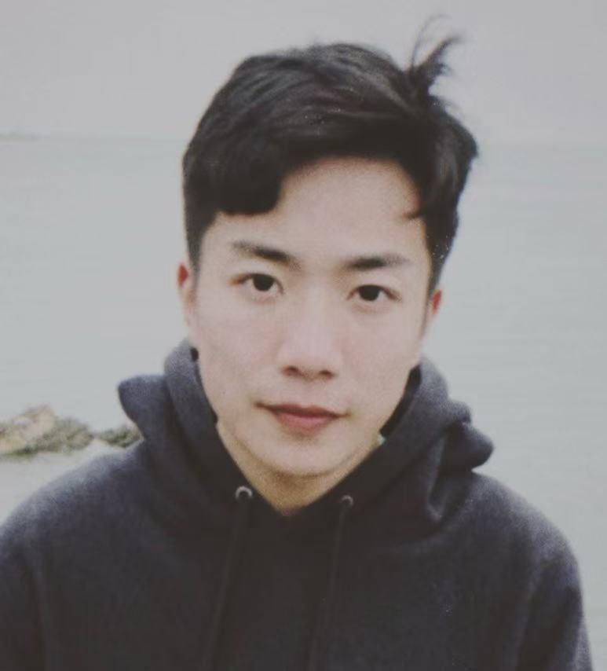

I am a PhD student at [SII](https://www.sii.edu.cn/), supervised by [Dr. Chaochao Lu](https://causallu.com/).

I study causal agents.

# Paper

- **ARise: Towards Knowledge-Augmented Reasoning via Risk-Adaptive Search**  
  Yize Zhang\*, Tianshu Wang\*, Sirui Chen, Kun Wang, Xingyu Zeng, Chaochao Lu  
  ACL 2025  
    [paper](https://arxiv.org/abs/2504.10893) |
    [repo](https://github.com/OpenCausaLab/ARise) |
    [project](https://opencausalab.github.io/ARise)

# CV

- [View CV (English)](/cv/) • [Download PDF](/assets/cv.pdf)  
- [View CV (中文)](/cv_zh/) • [Download PDF](/assets/cv_zh.pdf)

# Contact

- Email: ezzh2407 at gmail dot com
- WeChat: ezzh2407
